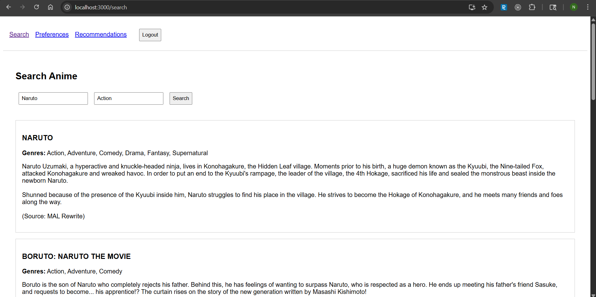
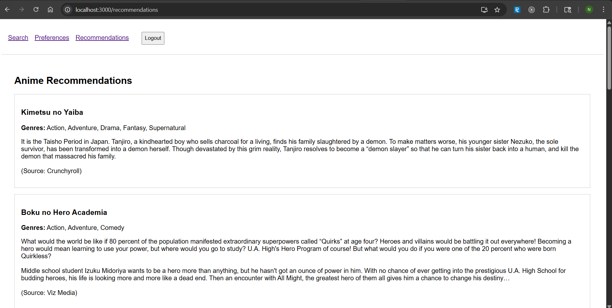
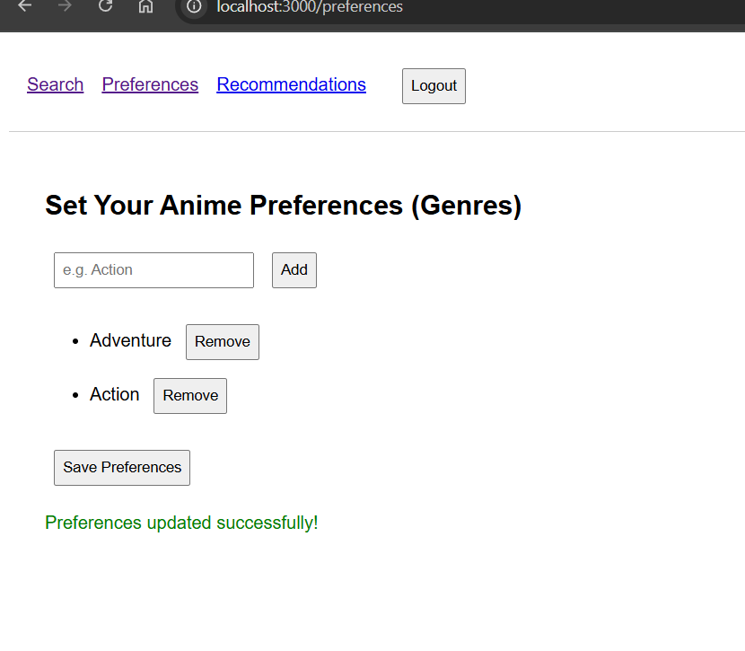

# Anime Recommender API

A FastAPI-based backend service that provides anime recommendations based on user preferences. The API integrates with AniList's GraphQL API to fetch anime data and provides personalized recommendations.

## 🏗️ Project Structure

```
anime-recommendor/
├── frontend/            # Frontend using ReactJS
├── models/
│   ├── preference_model.py     # Preference database model
│   └── user_model.py          # User database model
├── schemas/
│   ├── preference_schema.py    # Preference Pydantic schemas
│   └── user_schema.py         # User Pydantic schemas
├── views/
│   ├── anime.py               # Anime search and recommendation endpoints
│   ├── auth.py               # Authentication endpoints
│   └── preferences.py        # User preferences endpoints
├── database.py               # Database configuration
├── utils.py                  # Utility functions
├── main.py                   # FastAPI application entry point
└── requirements.txt          # Project dependencies
```

## 🚀 Features

- User authentication with JWT
- Anime search by name and genre
- Personalized anime recommendations based on user preferences
- User preference management
- Integration with AniList GraphQL API

## 🔧 Setup & Installation

### Backend Setup

1. Create and activate virtual environment:
```bash
python -m venv venv
.\venv\Scripts\activate
```

2. Install dependencies:
```bash
pip install -r requirements.txt
```

3. Set environment variables:
```bash
set DATABASE_URL=your_database_url
set SECRET_KEY=your_secret_key
```

4. Run the server:
```bash
fastapi run main.py
```

### Frontend Setup

1. Navigate to frontend directory:
```bash
cd frontend
```

2. Install dependencies:
```bash
npm install
```

3. Start development server:
```bash
npm start
```

## 📸 Screenshots

### Search Page

*Search anime by title and genre*

### Recommendations Page

*Get personalized anime recommendations based on preferences*

### Update Preferences Page

*Manage your genre preferences*

## 📚 API Documentation

### Authentication Endpoints

#### Register User
```http
POST /register
```
Request Body:
```json
{
    "username": "string",
    "password": "string"
}
```
Response:
```json
{
    "access_token": "string",
    "token_type": "bearer"
}
```

#### Login
```http
POST /login
```
Request Body:
```json
{
    "username": "string",
    "password": "string"
}
```
Response:
```json
{
    "access_token": "string",
    "token_type": "bearer"
}
```

### Anime Endpoints

#### Search Anime
```http
GET /search?name={name}&genre={genre}
```
Parameters:
- `name` (optional): Anime title to search for
- `genre` (optional): Genre to filter by

Response:
```json
{
    "data": {
        "Page": {
            "media": [
                {
                    "title": {
                        "romaji": "string"
                    },
                    "genres": ["string"],
                    "description": "string"
                }
            ]
        }
    }
}
```

#### Get Recommendations
```http
GET /recommendations
```
Authentication: Bearer Token Required

Response:
```json
{
    "data": {
        "Page": {
            "media": [
                {
                    "title": {
                        "romaji": "string"
                    },
                    "genres": ["string"],
                    "description": "string"
                }
            ]
        }
    }
}
```

### Preferences Endpoints

#### Get User Preferences
```http
GET /preferences
```
Authentication: Bearer Token Required

Response:
```json
[
    {
        "id": "integer",
        "genre": "string",
        "user_id": "integer"
    }
]
```

#### Update Preferences
```http
POST /preferences
```
Authentication: Bearer Token Required

Request Body:
```json
{
    "genres": ["string"]
}
```
Response:
```json
{
    "message": "Preferences updated successfully"
}
```

## 🔒 Authentication

The API uses JWT (JSON Web Tokens) for authentication. Include the token in the Authorization header:
```http
Authorization: Bearer <your_token>
```

## 🛠️ Technologies Used

- FastAPI
- SQLAlchemy
- PyJWT
- Pydantic
- AniList GraphQL API

## 📝 Error Handling

The API returns standard HTTP status codes:
- 200: Success
- 201: Created
- 400: Bad Request
- 401: Unauthorized
- 404: Not Found
- 500: Internal Server Error

## 🔐 Security Features

- Password hashing using bcrypt
- JWT token authentication
- Token expiration
- Protected routes using dependencies